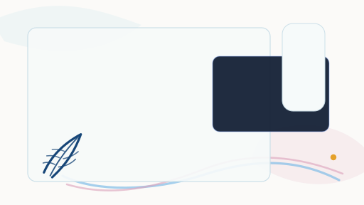
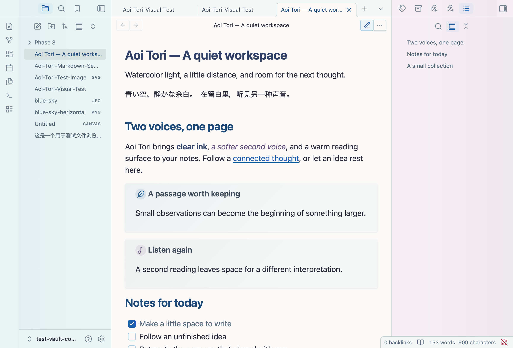
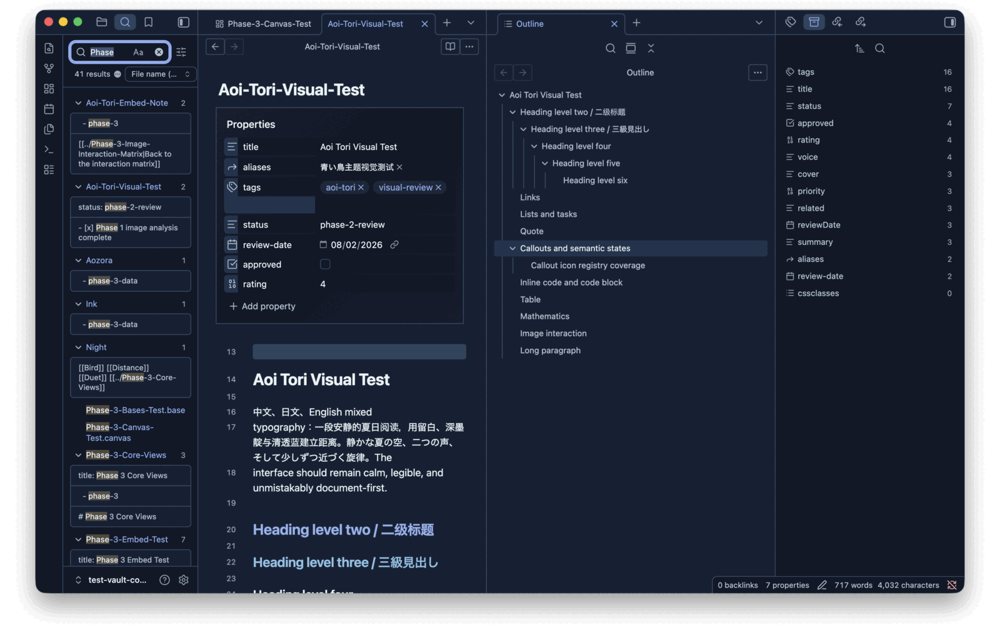
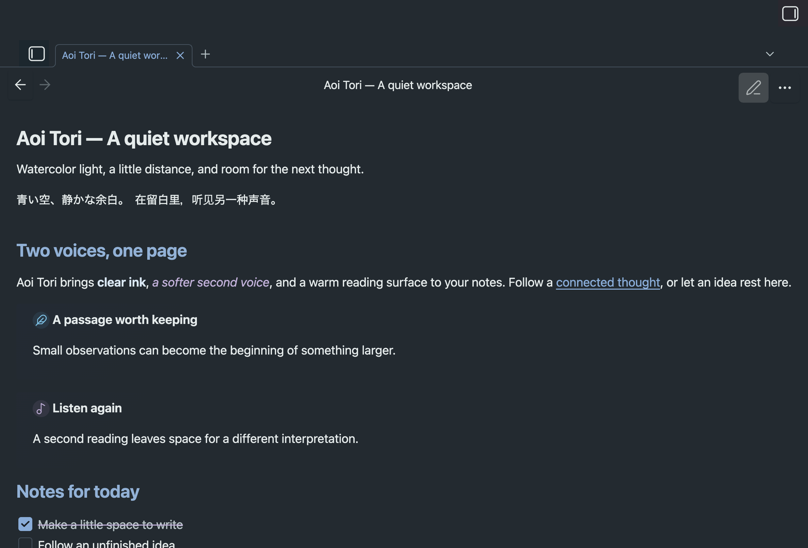

# Aoi Tori

A quiet Obsidian theme with watercolor cyan, warm paper, a soft blush counterpoint, and an
independent cool-grey dark mode. Built for reading, writing, and connected thoughts.

This is an unofficial project. It is not affiliated with Obsidian, Kyoto Animation, Pony Canyon, or
any film, studio, brand, or rights holder. The theme does not include official artwork, screenshots,
logos, character art, reference images, remote fonts, or remote images.



## Screenshots

Captured on 2026-09-13 in Obsidian Desktop **1.13.7** on macOS, using the source build from that
date and an original demonstration note. These are actual app captures. The newer Callout icon
family is not shown in these captures.

### Light — cyan, paper, blush



### Dark — a quiet, cool-grey night



### Tablet layout — desktop emulation



The third capture uses Obsidian Desktop's mobile emulator at a tablet-sized window. It is a layout
preview, not a physical iPad or phone test. Physical iOS, iPadOS, and Android testing remains open.

## Design idea

The default **Duet** palette gives each side of the workspace its own temperature: watercolor cyan
on the left, a nearly white bridge in the centre, and a pale blush on the right. The reading surface
stays warm and opaque, with clear ink and cobalt links, selection, and keyboard focus. Subtle static
washes add atmosphere without textures, blur, or animated backgrounds.

Dark mode has its own low-chroma cool-grey surfaces, ice-white text, and restrained blue
interactions. A slightly cooler left edge and a violet-leaning right edge preserve the duet without
turning the reading area into a bright gradient. Original feather, instrument, and everyday-motif
callouts offer small, optional accents.

## Features

- Light and dark modes.
- 15 original Callout icons: three feathers, a woodwind/brass ensemble, and quiet everyday motifs;
  22 px icons with circular badges, built into the theme with no extra plugin.
- Duet sidebars with a neutral bridge and a stable warm-paper reading surface.
- Accessible deep-ink body text and cobalt interaction states.
- Styled Live Preview, Source mode, and Reading view.
- Headings, links, unresolved links, lists, task lists, blockquotes, callouts, Properties, tables,
  inline code, code blocks, selection, highlight, and focus states.
- Buttons, inputs, textareas, dropdowns, toggles, menus, modals, tooltips, notices, and Settings
  controls.
- Native image interactions and semantic styling for Bases, Canvas, Graph, and core views.
- Responsive mobile and tablet rules; see the validation scope below.
- Optional Style Settings support with constrained palette, typography, workspace, editor, image,
  and accessibility controls.
- Reduced motion, increased contrast, and forced-colors CSS responses.

## A small language for your notes


Keep a passage with a falling feather, leave room for another voice, or mark an unfinished thought
with a breath. The theme includes original flute, oboe, trumpet, tuba and euphonium drawings, plus a
blue bird, an open window, resonance, a storybook and small footsteps.

```markdown
> [!aoi-tori] A passage worth keeping Small observations can become the beginning of something
> larger.

> [!aoi-duet] Another voice Leave room for a different interpretation.

> [!aoi-breath]- Before the next sentence An unfinished thought can stay here for a while.
```

The default is **22 px with a circular badge** in both modes. `aoi-tori` uses the falling feather;
`aoi-feather-light` and `aoi-feather-ink` select the other two versions. Existing `second-voice`
notes remain supported and now use the duet mark. Standard warning, error and success icons keep
their functional meaning.

See the **[complete Callout guide](docs/CALLOUTS.md)** for every icon, identifier, alias, and
copyable example. New types share a memorable `aoi-` prefix. No icon plugin or separate SVG
installation is required.

## Install

After Aoi Tori is accepted into Obsidian Community Themes, install it from:

```text
Settings -> Appearance -> Themes -> Manage
```

Until then, use the manual installation steps below.

## Manual install

1. Download or build the release package for the version you want to test.
2. Copy the theme files into your Vault:

   ```text
   <Vault>/.obsidian/themes/Aoi Tori/
   ```

3. The installed folder must contain:

   ```text
   manifest.json
   theme.css
   ```

4. Open Obsidian and choose:

   ```text
   Settings -> Appearance -> Themes -> Aoi Tori
   ```

For this repository, `npm run package` creates a clean local package at:

```text
dist/Aoi Tori/
```

The generated artifacts have separate purposes. `npm run build` writes the readable, formatted
development/install artifact to the repository root at `theme.css`. `npm run package` runs the full
quality gate and writes the minified release artifact directly to `dist/Aoi Tori/theme.css` while
copying `manifest.json` there. Both files are generated from `src/`; do not edit either file
directly. The `@settings` metadata comment is preserved in both forms.

## Aoi Tori callouts

Two semantic callout types ship with the theme. Both use Obsidian's built-in icon registry, so no
community plugin or bundled asset is required:

```markdown
> [!aoi-tori] A short note worth keeping The feather marks a passage the reader wants to return to.

> [!second-voice] A second reading The music marks a counterpoint, a dialogue, or a listening note.
```

They are optional. A note that never uses them still gets the full theme, and the callouts do not
replace any Obsidian functional icon. A `[!bluebird]` type is proposed but not shipped: Obsidian
1.13.7 does not register `lucide-bird`, and the theme does not bundle remote or third-party icons.

## Style Settings

Aoi Tori works without any community plugin. If you install
[Style Settings](https://github.com/obsidian-community/obsidian-style-settings), the theme exposes
48 bounded settings for palette, typography, workspace density, editor accents, image states, and
accessibility.

The defaults are the intended design. Choose **Duet** for the two-sided light palette, or Cloud /
Glass mist / Pale aqua for matching cool sidebars. These sidebar tint choices affect light mode;
dark mode keeps its independent palette. Soft sidebar contrast changes weight and hierarchy while
preserving readable text colours.

Other controls include wash strength, paper warmth, reading fonts, density, stronger focus, higher
contrast, reduced motion, and disabling decorative gradients. Essential text colours remain
constrained, and no option loads remote assets.

## Compatibility and validation

Minimum declared version: **Obsidian 1.13.4**. The current desktop visual review and the screenshots
above use **1.13.7** on macOS. Theme version **0.9.0** remains a public testing candidate.

| Scope                                                                            | Evidence                                                                                  |
| -------------------------------------------------------------------------------- | ----------------------------------------------------------------------------------------- |
| Current palette, reading view, and desktop/tablet-emulator screenshots           | Obsidian 1.13.7 on macOS                                                                  |
| Image editing, Vim, Bases, Canvas, Graph, pop-outs, and mobile layout regression | Earlier 1.13.4 pass; full regression has not been repeated for the latest palette changes |
| Style Settings installation and reset                                            | Earlier 1.0.9 plugin pass; current settings cascade has automated coverage                |
| Current build, CSS lint, formatting, repository audit, and manifest              | `npm run check`                                                                           |
| Colour validation                                                                | 45 static contrast pairs and 582 token-cascade scenarios                                  |

The scenario checker models supported CSS variables and setting combinations. It is not a complete
browser renderer or a replacement for Obsidian interaction testing. See
[the testing record](docs/TESTING.md) for per-feature evidence and remaining work.

## Not yet tested on real devices

- iPhone and iPad
- Android phone and tablet
- Real mobile virtual keyboard, safe-area hardware, long-press, swipe, pan, pinch, and double-tap
  flows
- Windows and Linux desktop window chrome
- Real Windows High Contrast
- Screen-reader sessions
- Broad third-party plugin compatibility

## Live Preview images

Aoi Tori preserves Obsidian's native image workflow. The theme does not apply destructive global
`img` rules, does not hide image controls, does not disable pointer events, and does not animate
image width or height.

Desktop Obsidian 1.13.4 testing covered pointer and keyboard image selection, copy/cut/delete,
grow/shrink/reset, Enter and Tab editing flows, Space and zoom-button Lightbox, resize, images in
lists, quotes, callouts, tables, embeds, pop-outs, narrow windows, and Vim image commands.

## Bases, Canvas, and Graph

Bases, Canvas, and Graph use Obsidian's official CSS variables where possible. The theme avoids
renderer-internal selectors for these views so that native virtualization, resizing, and drawing
remain owned by Obsidian.

Desktop testing covered Bases Table/Cards, Canvas nodes/groups/controls, and Graph node roles in
Obsidian 1.13.4. Physical mobile and broad plugin-overlay testing remain open.

## Accessibility

- Configured contrast pairs and setting scenarios pass in light and dark modes.
- Focus is visible for keyboard navigation and selected images.
- Reduced motion removes nonessential theme transitions.
- Increased contrast strengthens muted text, borders, and focus.
- Forced-colors rules have Chromium-emulation evidence and token-cascade checks.
- Automated checks do not yet cover every final painted property or interaction state.

Real Windows High Contrast and assistive-technology sessions are still required before a final
stable release.

## Development

Requirements:

- Node.js 20 or newer
- npm
- A local Obsidian test Vault

Commands:

```bash
npm install
npm run build
npm run format
npm run check
npm run package
```

`theme.css` and `dist/Aoi Tori/theme.css` are generated from `src/index.css`. Do not edit either
generated file directly.

Useful commands:

```bash
npm run dev           # watch source CSS and rebuild theme.css
npm run build         # build readable theme.css
npm run format        # format supported files
npm run lint          # CSS lint and formatting check
npm run audit         # repository and theme safety audit
npm run contrast      # configured contrast pairs
npm run scenarios     # setting-matrix contrast and forced-colors scenarios
npm run check         # complete local quality gate
npm run release       # check and rebuild the minified dist/Aoi Tori package
npm run package       # check, build dist/Aoi Tori/theme.css, and copy its manifest
```

## Report an issue

Please include:

- Obsidian version
- Installer version
- Theme version
- Operating system
- Light or dark mode
- Style Settings status
- Enabled community plugins
- Reproduction steps
- Screenshot or recording, with private content redacted
- DevTools DOM or Console information when relevant

Do not upload an entire private Vault.

## Known limits

- `0.9.0` is a public testing candidate, not a final stable `1.0.0`.
- The theme has not been submitted to Community Themes yet.
- Physical mobile devices and real Windows High Contrast remain untested.
- Third-party plugin compatibility is intentionally limited.
- Promotional assets are original UI-based graphics only; reference artwork is never bundled.

## Credits

Aoi Tori's visual system was derived from local reference-image analysis recorded in
`docs/visual-analysis.md` and `docs/DESIGN.md`. The reference images remain local design inputs and
are not redistributed.

Engineering research used official Obsidian documentation, the current Community Theme release flow,
Style Settings metadata documentation, and public theme repositories for release-structure
comparison only. No external theme code, icons, fonts, images, or assets were copied.

See [attribution](docs/attribution.md) for details.

## License

MIT. See [LICENSE](LICENSE).

Reference images and any third-party works used for private visual analysis retain their original
copyrights and are not covered by this repository's license.
