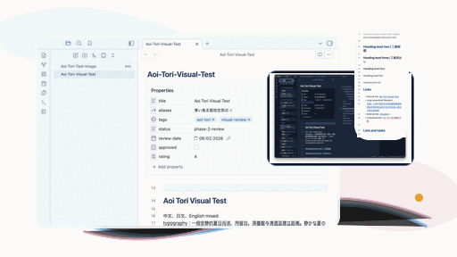

# Aoi Tori

Aoi Tori is an independent Obsidian community theme shaped by watercolor cloud white, clear sky
blue, deep cobalt, quiet sakura pink, gray-violet second voices, and a summer-night dark mode.

This is an unofficial project. It is not affiliated with Obsidian, Kyoto Animation, Pony Canyon, or
any film, studio, brand, or rights holder. The theme does not include official artwork, screenshots,
logos, character art, reference images, remote fonts, or remote images.



## Screenshots

### Light mode


### Dark mode


### Mobile layout preview


The mobile screenshot is from Obsidian Desktop's mobile emulator and controlled phone-class viewport
testing. Physical iOS, iPadOS, and Android devices still need real-device review.

## Design idea

Aoi Tori is not meant to be a generic blue dashboard. The light mode uses warm paper and cool
glass-mist surfaces for long reading, while cobalt marks the current state, links, primary actions,
selected images, and keyboard focus. Sakura pink and gray violet appear sparingly as a second voice
rather than a full pink theme. A very small gold-orange accent is reserved for optional decoration.

Dark mode is a separate night palette rather than an inversion of the light mode: low-chroma cool
grey surfaces that keep a violet leaning, ice-white text, and quiet cobalt interaction. The left and
right sidebars carry their own subtle temperature, and the theme avoids neon, glass blur, and heavy
shadows.

## Features

- Light and dark modes.
- Warm paper reading surface and cool glass-mist workspace panels.
- Accessible deep-ink body text and cobalt interaction states.
- Styled Live Preview, Source mode, and Reading view.
- Headings, links, unresolved links, lists, task lists, blockquotes, callouts, Properties, tables,
  inline code, code blocks, selection, highlight, and focus states.
- Buttons, inputs, textareas, dropdowns, toggles, menus, modals, tooltips, notices, and Settings
  controls.
- Tested desktop support for image selection, image actions, resize, Lightbox, pop-outs, narrow
  windows, Vim image commands, Bases, Canvas, Graph, embeds, and core views.
- Bounded mobile layout rules for Obsidian 1.13.4 responsive/mobile-emulation surfaces.
- Optional Style Settings support with constrained palette, typography, workspace, editor, image,
  and accessibility controls.
- Reduced motion, increased contrast, and forced-colors CSS responses.

## Install

After Aoi Tori is accepted into Obsidian Community Themes, install it from:

```text
Settings -> Appearance -> Themes -> Manage
```

Until then, use the manual installation steps below.

## Manual install

1. Download or build the release package for the version you want to test.
2. Copy the theme files into your Vault:

   ```text
   <Vault>/.obsidian/themes/Aoi Tori/
   ```

3. The installed folder must contain:

   ```text
   manifest.json
   theme.css
   ```

4. Open Obsidian and choose:

   ```text
   Settings -> Appearance -> Themes -> Aoi Tori
   ```

For this repository, `npm run package` creates a clean local package at:

```text
dist/Aoi-Tori/
```

The generated artifacts have separate purposes. `npm run build` writes the readable, formatted
development/install artifact to the repository root at `theme.css`. `npm run package` runs the full
quality gate and writes the minified release artifact directly to `dist/Aoi-Tori/theme.css` while
copying `manifest.json` there. Both files are generated from `src/`; do not edit either file
directly. The `@settings` metadata comment is preserved in both forms.

## Aoi Tori callouts

Two semantic callout types ship with the theme. Both use Obsidian's built-in icon registry, so no
community plugin or bundled asset is required:

```markdown
> [!aoi-tori] A short note worth keeping The feather marks a passage the reader wants to return to.

> [!second-voice] A second reading The music marks a counterpoint, a dialogue, or a listening note.
```

They are optional. A note that never uses them still gets the full theme, and the callouts do not
replace any Obsidian functional icon. A `[!bluebird]` type is proposed but not shipped: Obsidian
1.13.7 does not register `lucide-bird`, and the theme does not bundle remote or third-party icons.

## Style Settings

Aoi Tori works without any community plugin. If you install
[Style Settings](https://github.com/obsidian-community/obsidian-style-settings), the theme exposes
48 bounded settings for palette, typography, workspace density, editor accents, image states, and
accessibility.

The defaults are the intended design. The Style Settings options do not allow arbitrary essential
text colors and do not load remote assets.

## Supported Obsidian versions

- Minimum version candidate: Obsidian `1.13.4`
- Actual tested desktop version: Obsidian `1.13.4`
- Actual tested installer version: `1.13.4`

The minimum is intentionally not lowered because the current implementation was validated against
Obsidian 1.13.4 image, Settings, Bases, Canvas, Graph, mobile-emulation, and accessibility behavior.

## Tested platform

Tested during the release-candidate pass:

- macOS 26.5 on Apple silicon
- Obsidian Desktop `1.13.4`
- Installer `1.13.4`
- Electron `43.1.1`
- Light and dark modes
- Vim off and on for desktop image interactions
- Style Settings `1.0.9` in a local test Vault
- Obsidian Desktop mobile emulator and controlled phone/tablet viewport classes

## Not yet tested on real devices

- iPhone and iPad
- Android phone and tablet
- Real mobile virtual keyboard, safe-area hardware, long-press, swipe, pan, pinch, and double-tap
  flows
- Windows and Linux desktop window chrome
- Real Windows High Contrast
- Screen-reader sessions
- Broad third-party plugin compatibility

## Live Preview images

Aoi Tori preserves Obsidian's native image workflow. The theme does not apply destructive global
`img` rules, does not hide image controls, does not disable pointer events, and does not animate
image width or height.

Desktop Obsidian 1.13.4 testing covered pointer and keyboard image selection, copy/cut/delete,
grow/shrink/reset, Enter and Tab editing flows, Space and zoom-button Lightbox, resize, images in
lists, quotes, callouts, tables, embeds, pop-outs, narrow windows, and Vim image commands.

## Bases, Canvas, and Graph

Bases, Canvas, and Graph use Obsidian's official CSS variables where possible. The theme avoids
renderer-internal selectors for these views so that native virtualization, resizing, and drawing
remain owned by Obsidian.

Desktop testing covered Bases Table/Cards, Canvas nodes/groups/controls, and Graph node roles in
Obsidian 1.13.4. Physical mobile and broad plugin-overlay testing remain open.

## Accessibility

- Configured WCAG contrast pairs pass in light and dark modes.
- Focus is visible for keyboard navigation and selected images.
- Reduced motion removes nonessential theme transitions.
- Increased contrast strengthens muted text, borders, and focus.
- Forced-colors rules were checked through Chromium emulation.

Real Windows High Contrast and assistive-technology sessions are still required before a final
stable release.

## Development

Requirements:

- Node.js 20 or newer
- npm
- A local Obsidian test Vault

Commands:

```bash
npm install
npm run build
npm run format
npm run check
npm run package
```

`theme.css` and `dist/Aoi-Tori/theme.css` are generated from `src/index.css`. Do not edit either
generated file directly.

Useful commands:

```bash
npm run dev           # watch source CSS and rebuild theme.css
npm run build         # build readable theme.css
npm run format        # format supported files
npm run lint          # CSS lint and formatting check
npm run audit         # repository and theme safety audit
npm run contrast      # configured contrast pairs
npm run scenarios     # setting-matrix contrast and forced-colors scenarios
npm run check         # complete local quality gate
npm run release       # check and rebuild the minified dist/Aoi-Tori package
npm run package       # check, build dist/Aoi-Tori/theme.css, and copy its manifest
```

## Report an issue

Please include:

- Obsidian version
- Installer version
- Theme version
- Operating system
- Light or dark mode
- Style Settings status
- Enabled community plugins
- Reproduction steps
- Screenshot or recording, with private content redacted
- DevTools DOM or Console information when relevant

Do not upload an entire private Vault.

## Known limits

- `0.9.0` is a public testing candidate, not a final stable `1.0.0`.
- The theme has not been submitted to Community Themes yet.
- Physical mobile devices and real Windows High Contrast remain untested.
- Third-party plugin compatibility is intentionally limited.
- Promotional assets are original UI-based graphics only; reference artwork is never bundled.

## Credits

Aoi Tori's visual system was derived from local reference-image analysis recorded in
`docs/visual-analysis.md` and `docs/DESIGN.md`. The reference images remain local design inputs and
are not redistributed.

Engineering research used official Obsidian documentation, the current Community Theme release flow,
Style Settings metadata documentation, and public theme repositories for release-structure
comparison only. No external theme code, icons, fonts, images, or assets were copied.

See `docs/attribution.md` for details.

## License

MIT. See `LICENSE`.

Reference images and any third-party works used for private visual analysis retain their original
copyrights and are not covered by this repository's license.
